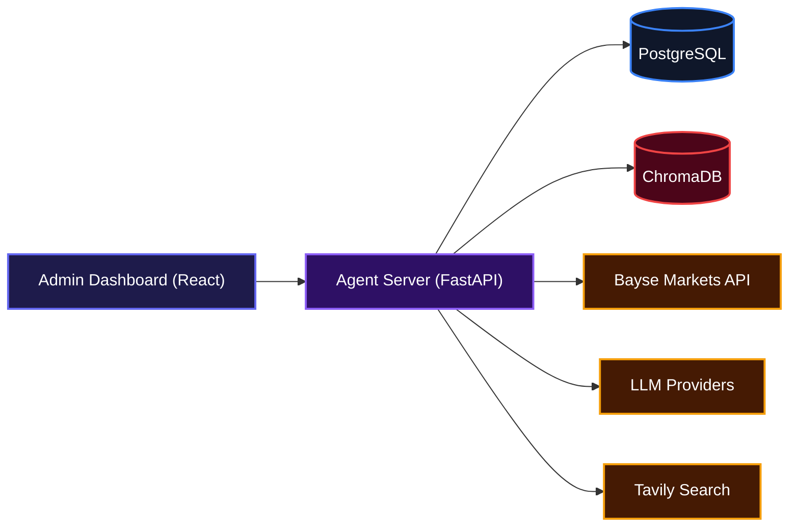
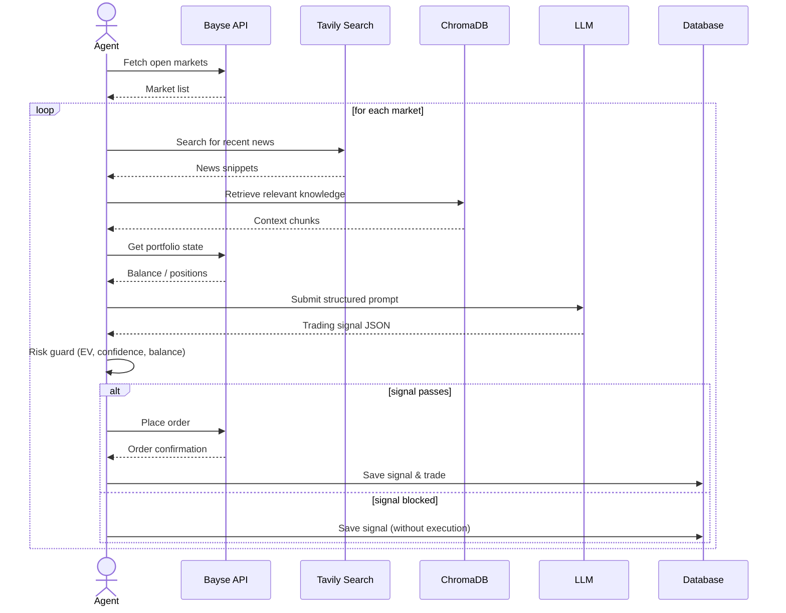
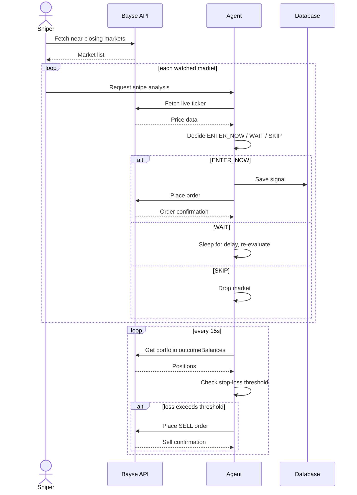

# Bayse AI Trading Agent

An autonomous prediction-market trading agent for [Bayse Markets](https://bayse.markets).  
The agent scans open markets, fetches live news and context data, uses an LLM to reason about probability, and places bets automatically — all while respecting configurable risk controls.  

If you trade prediction markets and want a disciplined, data-driven approach that runs without constant manual intervention, this agent handles the heavy lifting so you can focus on strategy.

## System Design



## Features

### Autonomous Market Analysis & Trading

The core agent runs on a schedule, scanning configured prediction markets. For each market it:

- Checks cooldowns so it doesn't re-analyze too quickly.
- Fetches live YES/NO prices, closing time, and relevant news via Tavily.
- Retrieves background knowledge from a ChromaDB vector store (RAG).
- Considers portfolio state: wallet balance, open positions, recent win/loss record.
- Sends everything to an LLM with a structured prompt, which returns a trading signal with confidence, suggested stake, and risk level.
- Validates the signal through a multi‑layer risk guard (EV, confidence, balance reserve, position cap).
- Optionally places the trade directly on Bayse Markets.

This flow repeats for every open market, making the agent fully hands‑off once configured.



### Risk Management

The agent enforces multiple safeguards before any bet reaches the exchange:

- **EV floor** – expected value must cover the Bayse flat fee.
- **Confidence threshold** – configurable minimum (default 65%).
- **Balance reserve** – a percentage of the wallet is kept untouched.
- **Position cap** – maximum simultaneous open bets.
- **50/50 skip** – markets exactly at 50/50 with no useful news are ignored.
- **Stop‑loss** – automatically sells if a position loses more than a configured percentage.

These checks are applied both during the analysis phase and at the moment of execution, serialised through a lock to prevent race conditions.

### Sniper & Stop‑Loss

For short‑interval markets (e.g., crypto 5‑minute), a dedicated sniper scans every 30 seconds for markets closing soon. It uses a faster LLM prompt with live ticker data and decides whether to enter, wait, or skip. Once the agent recommends entering, the position is taken immediately.

A parallel stop‑loss loop runs every 15 seconds, reading live portfolio values from Bayse. If a position has dropped past the stop‑loss threshold, a market sell order is placed to cut the loss.



### Live Dashboard

A React single‑page application provides real‑time visibility:

- Wallet balance, P&L, and open positions.
- Browse active markets with order‑book and price history.
- View generated signals, approve them manually, or clear history.
- Bayes analytics page to inspect the internal decision engine.
- Settings panel to toggle auto‑trading, adjust limits, and switch between LLM / Bayes live modes.

The dashboard connects to the backend via WebSocket for live updates on signals, trades, and model state changes.

## Installation

### Prerequisites

- Python 3.11+
- Node.js 18+
- PostgreSQL 14+
- API keys for Bayse, at least one LLM provider (Groq / Gemini / OpenAI / Anthropic), and Tavily.

### Clone the Repository

```bash
git clone https://github.com/abeenoch/agentBayse.git
cd agentBayse
```

### Backend Setup

```bash
cd backend
python -m venv venv
source venv/bin/activate      # macOS/Linux
# or venv\Scripts\activate   # Windows
pip install -r requirements.txt
```

Create a PostgreSQL database:

```sql
CREATE DATABASE agent_bayse;
```

Copy the environment template and fill in your keys:

```bash
cp .env.example .env
```

Edit `.env` to provide your API credentials (see Environment Variables below).

Start the server:

```bash
uvicorn app.main:app --reload
```

The server runs on `http://localhost:8000`. On first startup it creates all database tables and applies light‑weight migrations automatically.

### Frontend Setup

```bash
cd frontend
npm install
npm run dev
```

The dashboard runs on `http://localhost:5173`.

## Usage

1. Start the backend and frontend as described above.
2. Navigate to `http://localhost:5173` and log in with the admin credentials you set in `.env`.
3. The agent cycle begins immediately, scanning markets and generating signals on the configured interval.
4. Use the Dashboard to monitor wallet, positions, and activity.
5. In Settings you can enable auto‑trading, adjust risk parameters, and switch the decision engine between LLM and Bayes live mode.
6. The Signals page shows all generated signals; you can manually approve any that are pending.

Once everything is running, the agent works autonomously — you can check performance through the dashboard or inspect the Bayes analytics to see how the model is learning over time.

## API Documentation

All endpoints are protected with JWT authentication (except the token endpoint). Obtain a token via `POST /auth/token` and include it as a `Bearer` token in the `Authorization` header.

Below is a summary of the primary endpoints. The full Swagger UI is available at `http://localhost:8000/docs`.

### Authentication

| Method | Path          | Description               |
|--------|---------------|---------------------------|
| POST   | `/auth/token` | Obtain JWT access token   |
| GET    | `/auth/me`    | Return current user info  |

#### POST /auth/token

**Description**: Authenticate and receive a Bearer token.

**Request**: form-encoded  
```
username=admin&password=changeme
```

**Response**:
```json
{
  "access_token": "eyJhbGciOi...",
  "token_type": "bearer"
}
```

### Markets

| Method | Path                              | Description                      |
|--------|-----------------------------------|----------------------------------|
| GET    | `/markets`                        | List open events (finance default) |
| GET    | `/markets/trending`               | List trending events             |
| GET    | `/markets/series`                 | List available series            |
| GET    | `/markets/orderbook`              | Order book for given outcome IDs |
| GET    | `/markets/slug/{slug}`            | Get event by series slug         |
| GET    | `/markets/{event_id}/price-history` | Price history for an event      |
| GET    | `/markets/{market_id}/ticker`     | Ticker data for a market         |
| GET    | `/markets/{market_id}/trades`     | Recent trades for a market       |
| GET    | `/markets/{event_id}`             | Get event details                |

### Portfolio

| Method | Path                     | Description                         |
|--------|--------------------------|-------------------------------------|
| GET    | `/portfolio`             | Portfolio summary from Bayse        |
| GET    | `/portfolio/orders`      | List orders                         |
| GET    | `/portfolio/activities`  | Recent activity feed                |
| GET    | `/portfolio/positions`   | Open positions (real‑time from Bayse)|
| GET    | `/portfolio/assets`      | Wallet balances per currency        |

### Agent

| Method | Path                           | Description                                 |
|--------|--------------------------------|---------------------------------------------|
| POST   | `/agent/analyze`               | Trigger manual analysis for an event/market |
| GET    | `/agent/signals`               | List generated signals                      |
| POST   | `/agent/approve`               | Execute a PENDING signal manually           |
| POST   | `/agent/signals/clear`         | Delete all signals                          |
| POST   | `/agent/trades/clear‑stale`    | Mark ghost trades as STALE                  |
| POST   | `/agent/trades/repair‑terminal`| Normalise terminal‑but‑skipped trades       |
| GET    | `/agent/trades/diagnostics`    | Live trade reconciliation diagnostics       |
| GET    | `/agent/trades/trace`          | End‑to‑end trace for one market/trade       |
| GET    | `/agent/status`                | Agent status                                |
| GET    | `/agent/config`                | Read agent config                           |
| POST   | `/agent/config`                | Update agent config                         |
| GET    | `/agent/bayes/snapshots`       | List Bayes feature snapshots                |
| GET    | `/agent/bayes/report`          | Metrics & live Bayes state                  |
| POST   | `/agent/bayes/rebuild`         | Rebuild Bayes state from resolved trades    |
| GET    | `/agent/bayes/audit`           | YES/NO audit                                |
| GET    | `/agent/bayes/calibration`     | Calibration audit                           |
| POST   | `/agent/bayes/train`           | Trigger Bayes model training                |
| GET    | `/agent/bayes/eval`            | Walk‑forward offline evaluation             |
| GET    | `/agent/bayes/train/latest`    | Latest training run info                    |
| GET    | `/agent/bayes/live‑training`   | Currently active training run               |

#### POST /agent/approve

**Description**: Manually approve and execute a pending signal.

**Request**: query parameter  
```
signal_id={id}&amount=150
```

**Response**:
```json
{
  "status": "executed",
  "order_id": "bayse-order-id"
}
```

#### GET /agent/config

**Response**:
```json
{
  "auto_trade": true,
  "categories": [],
  "max_trades_per_hour": 10,
  "max_trades_per_day": 50,
  "max_open_positions": 3,
  "balance_floor": 0,
  "min_confidence": 65,
  "balance_reserve_pct": 0.30,
  "bayes_live_decision_mode": true,
  "bayes_state_key": "default"
}
```

#### POST /agent/config

**Request**:
```json
{
  "auto_trade": false,
  "max_open_positions": 2
}
```

**Response**: Full config object (same shape as GET).

### Trades

| Method | Path               | Description            |
|--------|--------------------|------------------------|
| POST   | `/trades`          | Place a trade manually |
| GET    | `/trades`          | List orders            |
| DELETE | `/trades/{order_id}`| Cancel an order       |

#### POST /trades

**Description**: Place a manual bet on a specific market.

**Request**: query parameters  
```
event_id=mock‑event&market_id=mock‑market&side=BUY&outcome=YES&amount=200&currency=NGN
```

**Response**: Bayse order confirmation.

### Search

| Method | Path      | Description              |
|--------|-----------|--------------------------|
| GET    | `/search` | Web search (Tavily)      |

### Webhook

| Method | Path          | Description                       |
|--------|---------------|-----------------------------------|
| POST   | `/webhook/order`| Inbound order resolution from Bayse |

**Note**: Requires a shared secret set in `WEBHOOK_SECRET`.

### WebSocket

| Protocol | Path      | Description                   |
|----------|-----------|-------------------------------|
| WS       | `/ws/live`| Real‑time updates for frontend |

## Environment Variables

All settings live in `backend/.env`. Copy `.env.example` and fill in your information.

| Variable | Description | Default |
|---|---|---|
| `APP_SECRET_KEY` | JWT signing secret | required |
| `ADMIN_USERNAME` | Dashboard login username | required |
| `ADMIN_PASSWORD` | Dashboard login password | required |
| `DATABASE_URL` | PostgreSQL async URL | required |
| `BAYSE_PUBLIC_KEY` | Bayse API public key | required |
| `BAYSE_PRIVATE_KEY` | Bayse API private key (HMAC signing) | required |
| `BAYSE_DEFAULT_CURRENCY` | Trading currency | `NGN` |
| `AI_PROVIDER` | `groq`, `gemini`, `openai`, `anthropic` | `gemini` |
| `GROQ_API_KEY` | Groq API key | — |
| `GROQ_MODEL` | Groq model name | `llama-3.3-70b-versatile` |
| `GEMINI_API_KEY` | Google Gemini API key | — |
| `GEMINI_MODEL` | Gemini model name | `gemini-2.5-flash` |
| `ANTHROPIC_API_KEY` | Anthropic API key | — |
| `OPENAI_API_KEY` | OpenAI API key | — |
| `SEARCH_PROVIDER` | Search backend | `tavily` |
| `TAVILY_API_KEY` | Tavily search API key | — |
| `SEARCH_INCLUDE_DOMAINS` | Comma‑separated preferred domains | — |
| `SEARCH_EXCLUDE_DOMAINS` | Comma‑separated blocked domains | — |
| `AGENT_AUTO_TRADE` | Enable autonomous order placement | `false` |
| `AGENT_MAX_OPEN_POSITIONS` | Max simultaneous open bets | `3` |
| `AGENT_MIN_CONFIDENCE` | Minimum LLM confidence to trade (0–100) | `65` |
| `AGENT_BALANCE_RESERVE_PCT` | Fraction of wallet kept untouched | `0.30` |
| `AGENT_MAX_POSITION_SIZE` | Max stake per bet (absolute) | `5000` |
| `AGENT_SCAN_INTERVAL_SECONDS` | Agent cycle frequency | `900` |
| `AGENT_REANALYZE_MINUTES` | Cooldown before re‑analysing a market | `25` |
| `AGENT_SERIES_SLUGS` | Comma‑separated series to scan (empty = all known) | — |
| `SNIPE_SERIES_SLUGS` | Series for the sniper | `crypto‑btc‑5min,...` |
| `SNIPE_OBSERVE_SECONDS` | How far out sniper starts watching | `300` |
| `STOP_LOSS_PCT` | Loss fraction to trigger sell | `0.35` |
| `BAYES_LIVE_DECISION_MODE` | Use Bayes encoder for live decisions | `true` |
| `BAYES_STATE_KEY` | Bayes state key | `default` |
| `MOCK_MODE` | Use mock responses (no real API calls) | `true` |
| `FRONTEND_ORIGIN` | CORS allowed origin | `http://localhost:5173` |
| `WEBHOOK_SECRET` | Shared secret for Bayse webhooks | — |

## Technologies Used

| Layer         | Technology                                                                                                         |
|---------------|--------------------------------------------------------------------------------------------------------------------|
| Backend       | [Python 3.11+](https://python.org) · [FastAPI](https://fastapi.tiangolo.com/) · [SQLAlchemy](https://sqlalchemy.org/) · [APScheduler](https://apscheduler.readthedocs.io/) |
| Database      | [PostgreSQL](https://www.postgresql.org/) · [asyncpg](https://github.com/MagicStack/asyncpg)                       |
| Vector Store  | [ChromaDB](https://www.trychroma.com/) with [Sentence‑Transformers](https://www.sbert.net/)                        |
| LLM Providers | [Groq](https://groq.com/) · [Google Gemini](https://ai.google.dev/) · [OpenAI](https://openai.com/) · [Anthropic](https://www.anthropic.com/) |
| Frontend      | [React 18](https://react.dev/) · [Vite](https://vitejs.dev/) · [TypeScript](https://www.typescriptlang.org/) · [TailwindCSS](https://tailwindcss.com/) |
| Monitoring    | [Recharts](https://recharts.org/) · [React Query](https://tanstack.com/query)                                      |
| Search        | [Tavily](https://tavily.com/)                                                                                      |
| Exchange API  | [Bayse Markets](https://bayse.markets/)                                                                            |

## Contributing

Contributions are welcome. If you'd like to improve the agent, fix bugs, or add new features, please open an issue or pull request on GitHub. Keep the coding style consistent and add tests where possible.

## Author

- **Enoch Abe**
  - X (Twitter): [https://x.com/industryshark](https://x.com/industryshark)

## Badges

[](https://python.org)
[](https://fastapi.tiangolo.com/)
[](https://react.dev/)
[](https://www.typescriptlang.org/)
[](https://tailwindcss.com/)
[](https://www.postgresql.org/)
[](https://www.trychroma.com/)

[]